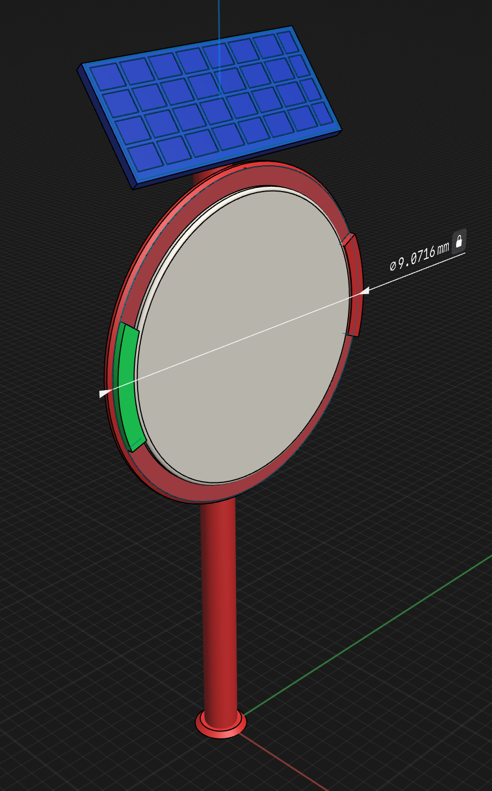
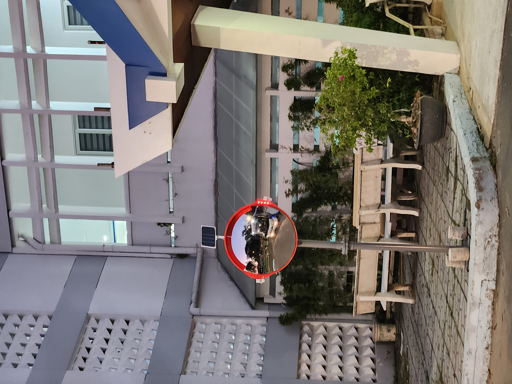

# Smart Mirror System (S.M.S)

## Smart Mirror System은 도로 위 반사경에 센서(초음파 센서나 레이더 센서)를 부착하여 도로의 사각지대를 제거하고, 반사경의 가장자리의 LED를 통하여 보행자나 운전자에게 시각적인 알림을 주어 안전 및 치안을 향상 시키는 아이디어이다.
 
### S.M.S의 전반적인 3D모델

### S.M.S의 실제 모습

### S.M.S 실제 협업 현장 사진

